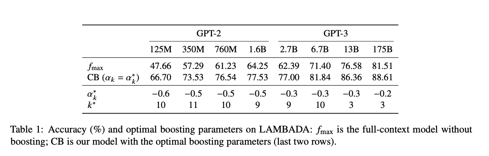

# coherence-boosted GPT

Replication project for [Coherence boosting: When your pretrained language model is not paying enough attention](https://arxiv.org/pdf/2110.08294.pdf)

I attempt to reproduce exact results of GPT and coherence boosted GPT
accuracy evaluations on LAMBADA; this is Table 1 in the paper.

## Results
|    | GPT-2 (124M) | GPT-2 (355M) | GPT-2 (774M) | GPT-2 (1.5B) |  GPT-3 (ada) | GPT-3 (babbage) | GPT-3 (curie) | GPT-3 (davinci) |
| ---|      ---     | ---          |    ---       |   ---        |  ---         |     ---         | ---           | ---             |
| $f_{max}$   | 46.1%          |  55.0%        |    58.76%      | 61.42%          |   61.52%        | 65.53%             |   75.57%         |  80.44%           |
|  CB ($\alpha_{k} = \alpha^{*}_{k} $)| 60.4%          |  71.41%         |    74.13%       | 74.75%          |   66.58%       | 67.36%             |   78.98%         |  82.07%          |
| $\alpha^{*}_{k}$ | -0.6         |  -0.5        |    -0.5       | -0.5          |   -0.3      | -0.3           |   -0.3        |  -0.2         |
| ${k}$ | 10         |  11        |    10       | 9          |   9      | 10           |   3        |  3        |

### GPT-2 Evaluations
The authors of the paper state, "We perform experiments with the GPT family of
models, closely replicating the evaluation setting of Radford et al. (2019)." As such,
I evaluate GPT-2 similar to how OpenAI evaluated their model. However, I quickly
discovered that their evaluation setting for GPT-2 is not best documented. [Others](https://github.com/openai/gpt-2/issues/131) have expressed confusion over how OpenAI evaluated GPT.
First, OpenAI pre-processed the LAMBADA dataset and evaluated GPT-2 on this
[pre-processed version](https://huggingface.co/datasets/EleutherAI/lambada_openai).
I found this out as evaluation on the standard [LAMBADA dataset](https://huggingface.co/datasets/lambada) yielded strictly worse results compared to the processed LAMBADA dataset.

While, the accuracy results do not match
the table exactly from the notebook, each result shows that coherence boosting
improves performance on LAMBADA significantly. This aligns with the findings
from the paper. The results that I believe most closely follow the experimental 
set-up are computing accuracy of predicting the last sub-token. GPT-2-small achieves an accuracy of 46.67% and the boosted GPT-2-small achieves an accuracy of 64.70%; the paper achieves 47.66% and 66.70% respectively. Below are all the accuracies results of the varying sizes of GPT-2.

All accuracy results are obtained using one GPU ($\texttt{Tesla A100}$) through Colab. 

|  GPT-2  $(124M, 125M_{\dagger})$                               |   Results      | Paper Results |
| ---                                    | ----           | ---           |
|  $f_{max}$                             |  46.1%         |  47.66%       |
|  CB ($\alpha_{k} = \alpha^{*}_{k} $)   |  60.4%         |  66.70%       |
|  $\alpha^{*}_{k}$                      |  -0.6          |  -0.6         |
|  $k^{*}$                               |  10            |  10           |

|  GPT-2  $(355M, 350M_{\dagger})$                                |   Results      | Paper Results |
| ---                                    | ----           | ---           |
|  $f_{max}$                             |  55.0%         |  57.29%       |
|  CB ($\alpha_{k} = \alpha^{*}_{k} $)   |  71.41%         |  73.53%       |
|  $\alpha^{*}_{k}$                      |  -0.5          |  -0.5         |
|  $k^{*}$                               |  11            |  11           |

|  GPT-2  $(774M, 760M_{\dagger})$                                |   Results      | Paper Results |
| ---                                    | ----           | ---           |
|  $f_{max}$                             |  58.76%         |  61.23%       |
|  CB ($\alpha_{k} = \alpha^{*}_{k} $)   |  74.13%         |  76.54%       |
|  $\alpha^{*}_{k}$                      |  -0.5          |  -0.5         |
|  $k^{*}$                               |  10            |  10           |

|  GPT-2  $(1.5B, 1.6B_{\dagger})$                                |   Results      | Paper Results |
| ---                                    | ----           | ---           |
|  $f_{max}$                             |  61.42%         |  64.25%       |
|  CB ($\alpha_{k} = \alpha^{*}_{k} $)   |  74.75%         |  77.53%       |
|  $\alpha^{*}_{k}$                      |  -0.5          |  -0.5         |
|  $k^{*}$                               |  9            |  9           |

$\dagger$ are the GPT-2 parameter counts from the paper.

#### Potential Reason for LAMBADA Accuracy Discrepencies

The GPT-2 models on hugging face have parameter counts that are slightly different from the reported number of parameters the GPT2 models have in the paper (e.g., GPT-2-small 125M (paper) vs 124M (hugging face), GPT-2-large 760M (paper) vs 774M (hugging face)). 

### GPT-3 Evaluations

All GPT-3 Evaluations are obtained by using OpenAI's Completions [API](https://platform.openai.com/docs/api-reference/completions?lang=python). One unfortunate constraint of this endpoint is that it only returns the top-5 logits corresponding to the tokens with highest probability. This might explain the magnitude differences between the boosted and regular model accuracies observed here and in the paper. By limiting to only top-5 logits, less information from the short context model is influencing the full-context model's output. Still, however, the results are consistent with the findings from the paper: coherence boosting improves long-range dependencies for LLMs. 

